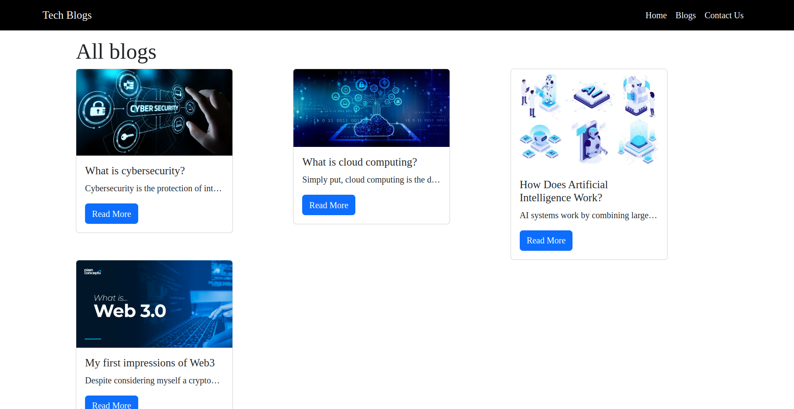

# Tech Blogs

Blogging site uses cutting-edge technology, including MongoDB, NodeJS, HTML, EJS, CSS, and JS to deliver informative blog content.

Home Page


Blogs Page




[](https://tech-blogs.onrender.com/) 

## Installation

Clone the repo

```bash
git clone https://github.com/kanhaiya04/Tech-blogs.git
cd Tech-blogs/
```

Use the package manager to install dependencies.

```bash
npm install
```

## Run on local server

To start the server
```bash
node app
```

